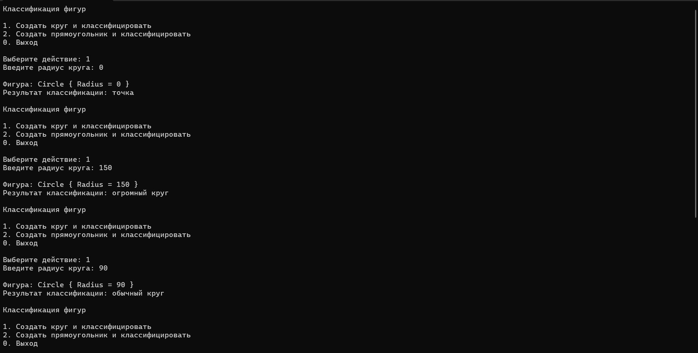
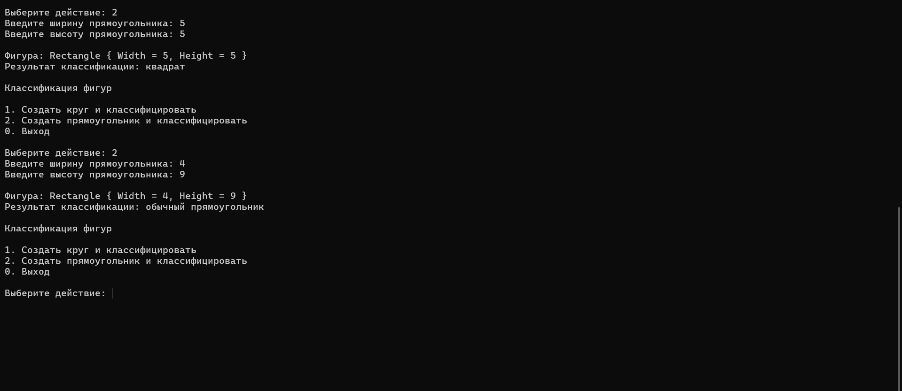

# PatternMatching
## Задание «Описание задания: Контрольная точка №15 — паттерн-матчинг»

# Вариант 1. Классификация фигур
Используйте классы Circle { double Radius }, Rectangle { double Width, double Height } из раздела про интерфейсы (или создайте заново).
1. Метод string Classify(object shape), возвращающий строку через switch-выражение.
2. Свойственный паттерн: Circle { Radius: 0 } → "точка".
3. Паттерн отношения внутри свойственного: Circle { Radius: > 100 } → "огромный круг".
4. when-условие: для Rectangle с Width == Height → "квадрат" (используя when, а не свойственный паттерн).
5. Завершающая ветка _ для всех остальных случаев.

## Результаты и проверочные ключи
| Вход | Ожидаемый результат |
|---|---|
| `new Circle(0)` | `"точка"` |
| `new Circle(150)` | `"огромный круг"` |
| `new Rectangle(5, 5)` | `"квадрат"` |
| `new Rectangle(4, 9)` | результат из ветки `_` |

# Результаты

